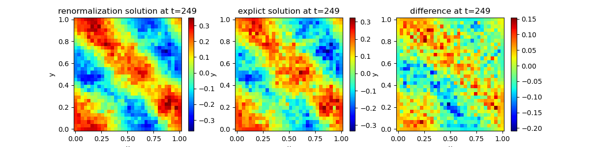

# SPDEBench: An Extensive Benchmark for Learning Stochastic PDEs

SPDEBench provides ready-to-use datasets ([Hugging Face](https://huggingface.co/datasets/SSPDEBench/Reuglar_and_Singular_SPDEBench)) for physically and mathematically significant SPDEs on 1-3D domains with periodic or Dirichlet boundary conditions. Both regular and singular SPDEs are taken into consideration. SPDEBench also incorporates representative ML baselines in operator learning, together with 7 evaluation metrics, including Sobolev and distributional metrics beyond the standard $L^2$ error. This repository contains the code used to generate datasets, train models, and evaluate results for the accompanying paper.

Below, we provide instructions on how to use code in this repository to generate datasets and train models as in our paper.



---

## Requirements

The project configuration supports Python >=3.9 and <3.13, with PyTorch >=2.1 and <2.4.
Install PyTorch using the command recommended for your platform and CUDA version on the
[official PyTorch website](https://pytorch.org/get-started/locally/).

To install the remaining dependencies:
```setup
pip install -r requirements.txt
```

---

## Data Generation

To generate the data, run the corresponding python files in `data_gen/examples/`. For instance, to generate data
of $\Phi^4_2$ equation with varying initial conditions and noise truncation degree 128, run the following:

```bash
cd data_gen/examples
python gen_phi42.py sim.fix_u0=False sim.eps=128
```

Equation settings can be tailored by choosing different config values. Common configuration arguments include:

- `a`, `b`, `Nx` (and `c`, `d`, `Ny` in 2D cases): spatial domain and resolution.
- `s`, `t`, `Nt`: time interval and resolution.
- `truncation` or `eps`: noise truncation level.
- `sigma`: coefficient for the additive noise term.
- `fix_u0`: whether to fix the initial condition across samples.
- `num`: number of generated samples.
- `sub_x`, `sub_t`: spatial and temporal subsampling rates.
- `save_dir`, `save_name`: output directory and file name.

These are representative examples. Please refer to the corresponding YAML file in `data_gen/configs/` and the generation script in `data_gen/examples/` for equation-specific options.


---

## Models

This repository contains code for multiple ML models, including NCDE, NRDE, NCDE-FNO, DeepONet, FNO, WNO, DLR-Net,
Galerkin Transformer, NSPDE / NSPDE-S, and NORS.
To train the model, run `train1d.py` or `train2d.py` in the corresponding folder named by the model.
For instance, after setting proper config args in corresponding `.yaml` file, change the working directory to the corresponding model folder and run the following:

```bash
python train1d.py
```

### Brief introduction to common model config args

Common configuration arguments include:

- `data_path`: path to the dataset used for training and evaluation.
- `ntrain`, `nval`, `ntest`: number of training, validation, and test samples.
- `batch_size`: batch size.
- `epochs`: number of training epochs.
- `learning_rate`: initial learning rate.
- `weight_decay`: optimizer weight decay, when used.
- `sub_t`, `sub_x`: temporal and spatial subsampling intervals, when used.
- `dim_x`, `dim_y`, `T`: spatial and temporal grid sizes, when used.
- `plateau_patience`, `plateau_terminate`, `delta`: learning-rate scheduling and early-stopping settings, when used.
- `save_dir`: output directory for checkpoints and logs.
- `checkpoint_file`: checkpoint file name.

These are representative examples rather than a complete schema. For model-specific options, please refer to the corresponding YAML file in `model/config/` and the training script in each model folder.


---

## Directory Structure

```
SPDE_hackathon
|-- data_gen
|   |-- configs        # YAML configuration files for data generation
|   |-- examples       # Data generation entry scripts
|   `-- src            # Core SPDE solver and noise generation utilities
|-- evaluations        # Evaluation metrics, statistics, and plotting utilities
|-- model
|   |-- config         # YAML configuration files for model training
|   |-- DeepONet
|   |-- DLR
|   |-- FNO
|   |-- GalerkinTransformer
|   |-- NCDE
|   |-- NCDEFNO
|   |-- NORS
|   |-- NRDE
|   |-- NSPDE
|   |-- WNO
|   `-- utilities.py
|-- predictions
|-- tests
|-- generate_prediction_files.py
|-- generate_sig_w1_test_data.py
|-- run_evaluation.py
|-- pyproject.toml
`-- requirements.txt
```

---

## Acknowledgements 
This project incorporates code from the following open-source repositories:

- [Feature Engineering with Regularity Structures](https://github.com/andrisger/Feature-Engineering-with-Regularity-Structures).
- [NeuralCDE](https://github.com/patrick-kidger/NeuralCDE). Licensed under the Apache-2.0 license.
- [Fourier Neural Operator](https://github.com/li-Pingan/fourier-neural-operator). Licensed under the MIT license.
- [torchcde](https://github.com/patrick-kidger/torchcde.git). Licensed under the Apache-2.0 license.
- [DEQ](https://github.com/locuslab/deq.git). Licensed under the MIT license.
- [Neural-SPDEs](https://github.com/crispitagorico/torchspde). Licensed under the Apache-2.0 license.
- [DLR-Net](https://github.com/sdogsq/DLR-Net).
- [Evaluation of Time Series Generative Models](https://github.com/DeepIntoStreams/Evaluation-of-Time-Series-Generative-Models/tree/main)
- [HaarApproximation](https://github.com/RazliTamir/HaarApproximation).

Many thanks to their authors for sharing these valuable contributions!
